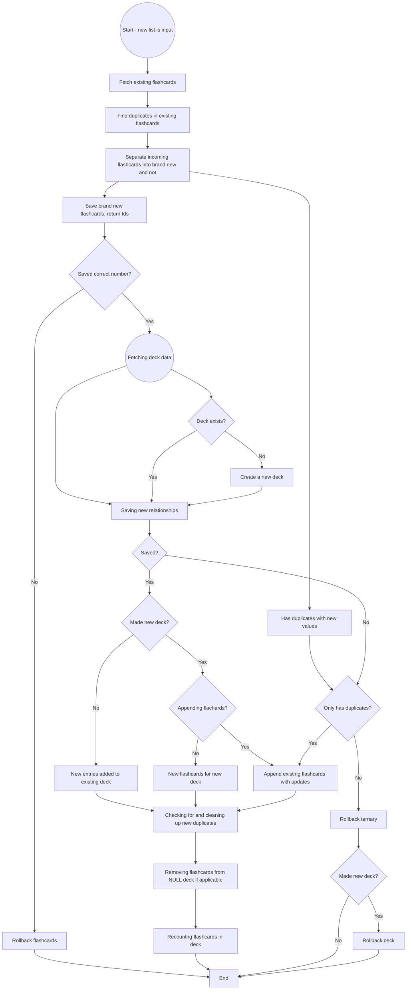

# ChineseCharactersApp - Showcase repo <a name="top"></a>
> The aim of this repo is to showcase my current knowledge with the hopes of helping me land a job as a junior developer

Link to live website: https://practice-chinese.azurewebsites.net

## About the app
- built in Visual Studio, using C# and .NET 7 MVC
- styling is HTML and CSS
- some effects done in JavaScript (including jQuery, Ajax)
- database side handled in SQL Server Management Studio 19; database is SQL Server database
- hosted on Azure

> The app is my "learning-by-doing" project. I am learning Chinese and I also wanted a tool to help me learn. On the website users can upload their Chinese vocabulary as flashcards, arrange them in decks, and practice recollection of Chinese characters/words/phrases. Spaced repetition is implemented via scoring.

<p align="center">
  
  
</p>

# Points that demonstrate my current knowledge
> In the following section I will attempt to list points which demonstrate my readiness to be employed as a junior developer

Summary:
- [Minor points](#minor)
- [Thinking about design/architecture](#design)
- [Thinking about SOLID](#solid)
  - [Single Responsibility Principle and Open/Closed Principle](#srp)
  - [Liskov Substitution Principle and Interface Segregation Principle](#lsp)
- [Dependency Injection](#di)
- [Thinking about DRY](#dry)
  - [Reusing methods](#methods)
  - [Using Generics](#generics)
  - ["Generic" models](#models)
  - [Reusing Partial Views](#partials)
  - [Dynamic redirects](#redirects)
- [ResultModel for convenient return type](#resultModel)
- [Using Async](#async)
- [Using method overloads](#overload)
- [Using Events](#events)
- [Using email service (Gmail SMTP) for password reset/recovery](#smtp)
- [Using Session/Cookies/Cache and Rate Limiting](#session)
- [Using AspNetCore.Identity Authentication and Password hashing](#auth)
- [Using static utility class/methods](#static)
- [Creating an activity "heatmap" calendar from scratch](#heatmap)
- [Clicking to select rows to add to list](#addLists)
- [Chinese characters matching logic](#characters)
  - [Processing the incoming lists flowchart](#flowchart)
  - [Detecting matching characters](#matching)

## Minor points <a name="minor"></a>
- database structure; *User/Flashcard/Deck relationships established via ternary relationship table, foreign keys (UserId, FlashcardId, DeckId) make up the composite PK*
- on file upload, mapping Excel file data to model is done using ClosedXML
- using GitHub Actions to deploy app to Azure using the workflow file; CI/CD
- using Azure environment variables to overwrite default connection string (hiding database connection string)
- using Sourcetree for version control

## Thinking about design/architecture <a name="design"></a>
> keep the file/folder structure clean, organized in a sensible way

- basic CRUD is separate, each feature gets its own folder (mostly like "Vertical-slice" architecture)
<p align="center">
  
</p>

## Thinking about SOLID <a name="solid"></a>

### Single Responsibility Principle and Open/Closed Principle <a name="srp"></a>
> my methods all have their own singular purpose

> method functionality is extended via calling other methods

> is also DRY

```C#
// UPLOAD FROM EXCEL LIST AND SAVE TO DATABASE
public async Task<ResultModel> UploadVocabularyListAsync(UploadModel model, string stringId)
{
/*...*/
    result = await ProcessAndSaveTheIncomingListAsync(cleanList, deck, Guid.Parse(stringId));
/*...*/
    return result;
}
```
```C#
// ADD FROM EXISTING PUBLIC DECKS
// copy selected public deck with flashcard values
public async Task<ResultModel> CopySelectedPublicDeckAsync(Guid userId, Guid deckId)
{
/*...*/
    result = await ProcessAndSaveTheIncomingListAsync(flashcardsInSelectedDeck, selectedDeck, userId);
/*...*/
    return result;
}
```
```C#
public async Task<ResultModel> ProcessAndSaveTheIncomingListAsync(List<FlashcardEntity> newList, DeckEntity deck, Guid userId)
{
/*...*/
    return result;
}
```

### Liskov Substitution Principle and Interface Segregation Principle <a name="lsp"></a>
> I am unable to break LSP due to using interfaces; I am also not overriding methods anywhere and so am not at risk of breaking LSP

> Interfaces are segregated by the same logic as CRUD/Feature services are and would make no sense to be segregated further

## Dependency Injection <a name="di"></a>
> Dependency Injection is the implementation of Dependency Inversion (SOLID)

> High-level modules should not depend on low-level modules; both should depend on abstractions. Abstractions should not depend on details; details should depend on abstractions. This principle encourages the use of interfaces or abstract classes to define dependencies, promoting flexibility and decoupling

```C#
namespace Services.CRUD
{
    public class FlashcardService : IFlashcardService
    {
        private readonly IExecuteSQLquery _database;
        private readonly ISharedCRUDService _sharedCRUD;
        public FlashcardService(IExecuteSQLquery database, ISharedCRUDService sharedCRUD)
        {
            _database = database;
            _sharedCRUD = sharedCRUD; // Flashcard and Deck Services may only have dependency on sharedCRUD for CRUD, all shared Flashcard and Deck methods are moved there; this prevents circular dependency issues
        }
...
```
```C#
await DeleteFlashcardByIdAsync(flashcardId);
await _sharedCRUD.UpdateEntriesCountByDeckIdAsync(deckId);
```
- SharedCRUD class is introduced to circumvent occurences of circular dependency. Certain methods are not feature-specific (*e.g. Add Lists feature*) but are still reused in different classes (*e.g. fetching decks is needed both for filtering flashcard lists by deck in FlashcardService as well as for overview in DeckService*), hence SharedCRUD is used.

## Thinking about DRY <a name="dry"></a>
> why do the same thing twice when it can be reused?

### Reusing methods <a name="methods"></a>
Every unit of work that needs to be reused gets its own method; i.e. filtering/sorting of lists
```C#
public (IEnumerable<FlashcardsAndDecksViewEntity>, int, int) FilterSortAndPageFlashcardList(List<FlashcardsAndDecksViewEntity> list, int? page, string sortBy, string filterBy)
{
    // filtering
    IEnumerable<FlashcardsAndDecksViewEntity> filteredList = FilterListByParameters(list, filterBy, null, null, null);
    // sorting
    IEnumerable<FlashcardsAndDecksViewEntity> sortedList = SortListByParameter(filteredList, sortBy);
    // paging
    var (pagedList, pageNumber, totalPages) = GetTheSpecificPage(sortedList, page);
    return (pagedList, pageNumber, totalPages);
}
```
> Methods then either call *FilterSortAndPageFlashcardList* or one of the individual methods contained in it, depending on use case.

...

### Using Generics <a name="generics"></a>
My ExecuteSQLquery class only has 3 methods, where the only difference is their return type (int, object or List<object>)
```C#
// RETURN MODEL LIST // ModelList and GenericParameters are both generics
public async Task<List<ModelList>> ExecuteQueryAsync_ReturnDTOlist<ModelList, GenericParameters>(GenericParameters parameters, string sqlQuery)
{
    string connectionString = _configuration.GetConnectionString("DefaultConnection");
    using (SqlConnection connection = new SqlConnection(connectionString))
    {
        await connection.OpenAsync();
        List<ModelList> list = (await connection.QueryAsync<ModelList>(sqlQuery, parameters)).ToList(); 
        return list;
    }            
}
```
> Service layer methods needing to access the database will call one of the three methods and it is irrelevant which model class the object they are using is
```C#
List<CardDeckUserTernaryTableEntity> list = await _database.ExecuteQueryAsync_ReturnDTOlist<CardDeckUserTernaryTableEntity, object>(parameters, sqlQuery);
...
List<PublicDecksOverviewViewEntity> list = await _database.ExecuteQueryAsync_ReturnDTOlist<PublicDecksOverviewViewEntity, object>(parameters, sqlQuery);
...
List<FlashcardEntity> list = await _database.ExecuteQueryAsync_ReturnDTOlist<FlashcardEntity, object>(parameters, sqlQuery);
```

...

### "Generic" models <a name="models"></a>
E.g. when changing username/password/email address the user will always have to input three string values into fields
> For example when changing password - input current password first, then input new password twice - for safety and prevent typos

Therefore, instead of creating three separate model classes like ChangeUsernameModel, ChangePasswordModel and ChangeEmailModel, I only have a simple ThreeStringsModel:
```C#
namespace Models.FormModels
{
    public class ThreeStringsModel
    {
        public string StringOne { get; set; }
        public string StringTwo { get; set; }
        public string StringThree { get; set; }
    }
}
```

Furthermore, since MVC Views only allow using one Model, therefore requiring to create a new model class for new complex types, I can combine existing model classes easily.
> For example, since changing username/password/email address requires checks against the current user, the current user needs to be loaded and part of the used Model in the View, albeit with hidden values
```C#
namespace Models
{
    public class EditUserInfoModel
    {
        public UserEntity User { get; set; }
        public ThreeStringsModel Strings { get; set; }
    }
}
```

...

### Reusing Partial Views <a name="partials"></a>
When it is cleaner and simpler to adjust a partial View and its controller method to be reused/loaded in several Views, it is better than having two or more mostly similar separate files.
> must consider different input parameters (method signature) and return type

> must consider redirects ("back to" button); solved via HttpContext.Request.Path

```C#
<!-- _FlashcardsTablePartialView -->
<!--
    Deck/ShowDeckDetails (DeckDetailsView) // public decks
    Deck/EditDeckFromView (DeckEditView) // user's decks
-->
@using Models.Database_Entities; 
@model IEnumerable<FlashcardEntity>
@{
/*...*/
    string currentUrl = ViewBag.CurrentUrl; // gets the current URL from controller, so I can dynamically populate redirects and so reuse this partial with any method and controller
    string[] urlSegments = currentUrl.Split('/');
    string controllerName = urlSegments[1]; // will insert variable for redirect instead of string literal
    string methodRedirect = urlSegments[2]; // -||- 
/*...*/
}
/*...*/
@if (!string.IsNullOrEmpty(ViewBag.SearchFilter)) // e.g. clear filter
{
    <a href="@Url.Action(methodRedirect, controllerName, new { deckId = ViewBag.DeckId })">Clear filter</a>
}
/*...*/
```

...

### Dynamic redirects <a name="redirects"></a>
Using HttpContext.Request.Path to get source controller/method to pass as parameter, then dynamically redirecting to wherever the method was called from instead of a fixed action/view
> e.g. users may delete flashcards from several different Views

```C#
public async Task<ActionResult> DeleteCard(Guid id, string source, /* other params */)
{
    /* ... */
    string[] urlSegments = source.Split('/');
    string controllerName = urlSegments[1];
    string methodName = urlSegments[2];
    return RedirectToAction(methodName, controllerName, new { deckId, /* other params */ });
}
```

...

## ResultModel for convenient return type <a name="resultModel"></a>
For success/failure, returning bool is not specific enough, I like having a message with my result, no matter if fail or success

```C#
namespace Models
{
    public class ResultModel
    {
        public bool IsSuccess {  get; set; }
        public string Message { get; set; }
    }
}
```
```C#
ResultModel result = await _flashcardService.AddNewFlashcardAsync(model, userId);
if (result == null)
{
    TempData["FailureMessage"] = "Something went wrong!";
    return RedirectToAction( /* ... */ );
}
else if (!result.IsSuccess) // can set failure with custom message
{
    TempData["FailureMessage"] = result.Message;
    return RedirectToAction( /* ... */ );
}
TempData["SuccessMessage"] = result.Message;
return RedirectToAction( /* ... */ );
```

## Using Async <a name="async"></a>
- On I/O operations such as when querying the database
> the goal is to not block threads while waiting for execution to complete

```C#
// controller layer method - calls service layer method
public async Task<ActionResult> FlashcardsOverviewTable( /* ... */ )
{
/* ... */
  entireList = await _flashcardService.GetWholeListFromFlashcardsAndDecksViewByUserIdAsync(userId);
/* ... */
}
// services layer method - calls database access method
public async Task<List<FlashcardsAndDecksViewEntity>> GetWholeListFromFlashcardsAndDecksViewByUserIdAsync(Guid id)
{
/* ... */
    List<FlashcardsAndDecksViewEntity> list = await _database.ExecuteQueryAsync_ReturnDTOlist<FlashcardsAndDecksViewEntity, object>(parameters, sqlQuery);
/* ... */
}
// database access - queries the database
public async Task<List<ModelList>> ExecuteQueryAsync_ReturnDTOlist<ModelList, GenericParameters>(GenericParameters parameters, string sqlQuery)
{
    string connectionString = _configuration.GetConnectionString("DefaultConnection");
    using (SqlConnection connection = new SqlConnection(connectionString))
    {
        await connection.OpenAsync();
        List<ModelList> list = (await connection.QueryAsync<ModelList>(sqlQuery, parameters)).ToList(); 
        return list;
    }            
}
```

- On concurrent method execution
> methods not needing to await each others' completion (return data of one is not input parameter of the other) can be executed concurrently to speed up completion of code

```C#
Task updateTimeUpdated = _deckService.UpdateTimeUpdatedForDeckByIdAsync(deckId);
Task removePlaceholder = _sharedCRUD.RemovePlaceholderFlashcardAsync(deckId);
await Task.WhenAll(updateTimeUpdated, removePlaceholder);
```

## Using method overloads <a name="overload"></a>
Convenient with simple/straightforwad methods; I can keep the method name for simplicity but change the signature and return type.

```C#
public async Task<bool> DeleteTernaryTableRelationshipAsync(Guid id) {} // the ternary table has three columns of uniqueidentifiers (guid); this method allows deletion by any id
public async Task DeleteTernaryTableRelationshipAsync(Guid deckId, Guid flashcardId) {}
public async Task DeleteTernaryTableRelationshipAsync(Guid userId, Guid deckId, HashSet<Guid> flashcardIds) {}
```

## Using Events <a name="events"></a>
Used to provide updates for the progress bar partial view shown during upload and copying public decks.

```C#
// in the relevant service layer class
public event EventHandler<ProgressBarModel> ProgressBarUpdated;
protected void UpdateProgressBar(int value, string message)
{
    ProgressBarUpdated?.Invoke(this, new ProgressBarModel
    {
        ProgressValue = value,
        ProgressMessage = message
    });
}
```
```C#
// in the relevant method
UpdateProgressBar(10, "Fetching your existing lists.");
UpdateProgressBar(20, "Looking for duplicates.");
/* etc. */
```
```C#
// in the relevant controller class
namespace MVC.Controllers.AddLists
{
    [Authorize]
    public class AddListsController : Controller
    {
          private readonly IAddListsService _service;
          private readonly ConcurrentDictionary<string, IMemoryCache> _userCaches = new ConcurrentDictionary<string, IMemoryCache>();
          public AddListsController(IAddListsService service, ConcurrentDictionary<string, IMemoryCache> userCaches)
          {
              _service = service;
              _service.ProgressBarUpdated += OnProgressBarUpdate; // subscribed to event
              _userCaches = userCaches;
          }
          // event handling       
          private void OnProgressBarUpdate(object sender, ProgressBarModel e) // fixed signature
          {
              string userId = User.FindFirst(ClaimTypes.NameIdentifier).Value;
              if (!_userCaches.ContainsKey(userId))
              {
                  _userCaches[userId] = new MemoryCache(new MemoryCacheOptions());
              }          
              _userCaches[userId].Set("lastProgressPercentage", e.ProgressValue);
              _userCaches[userId].Set("lastProgressMessage", e.ProgressMessage);            
          }
/* and then the relevant method retrieves the data from _userCaches[] */
```

## Using email service (Gmail SMTP) for password reset/recovery <a name="smtp"></a>
Using System.Net.Mail
> only requires a Gmail account and an App password set up

> password is stored as string in appsettings.json, retrieved via IConfiguration; it is not exposed in code, Azure overrides smtpPassword value with actual password through environmental variables

```C#
public class EmailsService : IEmailsService
{
    private readonly IExecuteSQLquery _database;
    private readonly IConfiguration _configuration;
    public EmailsService(IExecuteSQLquery database, IConfiguration configuration)
    {
        _database = database;
        _configuration = configuration;
    }

    public ResultModel SendEmail(string receivingAddress, string mailTitle, string mailBody)
    {
        MailAddress fromAddress = new MailAddress("ivan.kovac.app.emailservice@gmail.com", "Chinese practice app");
        MailAddress toAddress = new MailAddress(receivingAddress);

        string smtpPassword = _configuration.GetConnectionString("smtpPassword");

        SmtpClient smtp = new SmtpClient
        {
            Host = "smtp.gmail.com",
            Port = 587,
            EnableSsl = true,
            DeliveryMethod = SmtpDeliveryMethod.Network,
            UseDefaultCredentials = false,
            Credentials = new NetworkCredential("ivan.kovac.app.emailservice@gmail.com", smtpPassword)
        };

        using (MailMessage message = new MailMessage(fromAddress, toAddress)
        {
            Subject = mailTitle,
            Body = mailBody
        })
        {
            smtp.Send(message);
        }
/* ... */
```

## Using Session/Cookies/Cache and Rate Limiting <a name="session"></a>
The goal is to minimize costs by reducing total amount of database calls.

> Methods fetching data first check session/cookie for it, if found fetch it from session instead of the database

> session/cookie is cleared on edit or deletion

```C#
public async Task<ActionResult> FlashcardPractice(FlashcardPracticeSettingsEntity settings, int index)
{    
    // FETCHES MY SELECTED FLASHCARDS IF FOUND, ELSE IT GOES TO NARROW DOWN THE USER'S LIST BASED ON SETTINGS
    string hasFlashcardsToShow = HttpContext.Session.GetString("List<FlashcardsAndDecksViewEntity>_FlashcardPractice");
    if (!string.IsNullOrEmpty(hasFlashcardsToShow))
    {
        _flashcardsToShow = JsonConvert.DeserializeObject<List<FlashcardsAndDecksViewEntity>>(hasFlashcardsToShow);
        settings = JsonConvert.DeserializeObject<FlashcardPracticeSettingsEntity>(HttpContext.Session.GetString("Settings"));
    }
    else
    {
        List<FlashcardsAndDecksViewEntity> rawList = JsonConvert.DeserializeObject<List<FlashcardsAndDecksViewEntity>>(HttpContext.Session.GetString("List<FlashcardsAndDecksViewEntity>_StartPractice"));
        _flashcardsToShow = _practiceService.SelectFlashcardsBasedOnSettings(settings, rawList);

        // check if user has the minimum number of flashcards to even practice
        if (_flashcardsToShow.Count < settings.HowMany)
        {
            TempData["FailureMessage"] = /* ... */;
            return RedirectToAction("StartPractice");
        };
        HttpContext.Session.SetString("List<FlashcardsAndDecksViewEntity>_FlashcardPractice", JsonConvert.SerializeObject(_flashcardsToShow)); 
        HttpContext.Session.SetString("Settings", JsonConvert.SerializeObject(settings)); // Viewbag can't carry complex types, session is a workaround
    }
/* ... */
```
```C#
public void ClearSessionData()
{
    HttpContext.Session.Remove("List<FlashcardsAndDecksViewEntity>_FlashcardsOverviewTable");
    /* ... */
    foreach (string key in HttpContext.Session.Keys.ToList())
    {
        if (key.StartsWith("List<FlashcardEntity>_ShowFlashcardsForDeckPartialView_"))
        {
            HttpContext.Session.Remove(key);
        }
    }
    /* ... */
    HttpContext.Session.Remove("List<FlashcardsAndDecksViewEntity>_StartPractice");
    Response.Cookies.Delete("FiveMostDifficultFlashcardsCookie");
}
```

Rate Limiting is done to try and prevent DOS attacks by setting hard limits on number of requests that can be made from each IP address.
> required the AspNetCoreRateLimit 5.0 NuGet package

```C#
// in Program.cs; values are set in appsettings.json
/* ... */
var configuration = builder.Configuration;
builder.Services.AddMemoryCache();
builder.Services.Configure<IpRateLimitOptions>(configuration.GetSection("IpRateLimiting"));
builder.Services.Configure<IpRateLimitPolicies>(configuration.GetSection("IpRateLimitPolicies"));
builder.Services.AddInMemoryRateLimiting();
builder.Services.AddSingleton<IIpPolicyStore, MemoryCacheIpPolicyStore>();
builder.Services.AddSingleton<IRateLimitCounterStore, MemoryCacheRateLimitCounterStore>();
builder.Services.AddSingleton<IRateLimitConfiguration, RateLimitConfiguration>();
/* ... */
app.UseIpRateLimiting();
/* ... */
```

k6 testing confirms IP rate limiting is being applied:
<p align="center">
  
</p>

## Using AspNetCore.Identity Authentication and Password hashing <a name="auth"></a>
Using Microsoft.AspNetCore.Identity, AspNetCore.Authentication and System.Security.Claims
> passwords stored to the database are all hashed

```C#
public async Task<ActionResult> Login(UserEntity incomingUser)
{
    // all fields required
    if (string.IsNullOrEmpty(incomingUser.Username) || string.IsNullOrEmpty(incomingUser.Password))
    {
        TempData["FailureMessage"] = "All fields are required!";
        return View("LoginView");
    }
    // VERIFYING PASSWORD HASH
    UserEntity foundUser = await _userService.FindAndReturnUserAsync(incomingUser.Username);
    if (foundUser == null)
    {
        TempData["FailureMessage"] = "Incorrect username or password.";
        return View("LoginView");
    }
    IdentityUser identityUser = new IdentityUser { UserName = incomingUser.Username };
    PasswordHasher<IdentityUser> passwordHasher = new PasswordHasher<IdentityUser>();
    PasswordVerificationResult verificationResult = passwordHasher.VerifyHashedPassword(identityUser, foundUser.Password, incomingUser.Password);
    // -----------------------

    if (verificationResult == PasswordVerificationResult.Success)
    {
        var claims = new List<Claim>
        {
            new Claim(ClaimTypes.Name, foundUser.Username),
            new Claim(ClaimTypes.NameIdentifier, foundUser.Id.ToString()),
        };
        var claimsIdentity = new ClaimsIdentity(claims, CookieAuthenticationDefaults.AuthenticationScheme);

        await HttpContext.SignInAsync( // od .NET default metoda
            CookieAuthenticationDefaults.AuthenticationScheme,
            new ClaimsPrincipal(claimsIdentity),
            new AuthenticationProperties
            {
                IsPersistent = false,
                ExpiresUtc = DateTime.UtcNow.AddMinutes(720) // 12 hours
            });

        await _sharedCRUD.LogUserActivtyAsync(foundUser.Id, "LoggedIn");
        return RedirectToAction("Index", "Home");                
    }
    TempData["FailureMessage"] = "Verification failed. Incorrect username or password.";
    return View("LoginView");
}
```

Validation is done via the [Authorize] attribute.

```C#
[Authorize]
public class AddListsController : Controller
{
/* ... */
```

## Using static utility class/methods <a name="static"></a>
These are for utilities, one-off operations where I need to manipulate data but don't need to instantiate objects

For example:
```C#
public static class StaticUtilityMethods
{
/* ... */
  public static bool FindSameValueBetweenStrings(string a, string b)
  {
      bool result = (string.IsNullOrEmpty(a) && string.IsNullOrEmpty(b)) // Both are empty or null
                      ||
                      (
                          !string.IsNullOrEmpty(a) && !string.IsNullOrEmpty(b) // Both aren't null
                          &&
                          (
                              ( // found in parts between "|"
                                  b.Split('|').Any(part => part.Trim().Equals(a.Trim(), StringComparison.OrdinalIgnoreCase))
                                  ||
                                  a.Split('|').Any(part => part.Trim().Equals(b.Trim(), StringComparison.OrdinalIgnoreCase))
                              )
                              ||
                              ( // found in its entirety
                                  a.Trim().Contains(b.Trim(), StringComparison.OrdinalIgnoreCase)
                                  ||
                                  b.Trim().Contains(a.Trim(), StringComparison.OrdinalIgnoreCase)
                              )
                          )
                      );
      return result; // e.g. finds "learn" in "to study | learn", meaning fewer bad appendings happening
  }
/* ... */
```

## Creating an activity "heatmap" calendar from scratch <a name="heatmap"></a>
> I like the GitHub heatmap and wanted one for my app; it has its flaws, but like the app itself - it is a continuous work in progress

<p align="center">
  
</p>

## Clicking to select rows to add to list <a name="addList"></a>
Using JavaScript/jQuery

<p align="center">
  
</p>

```C#
<form id="flashcardForm" method="post" action="@Url.Action("AddSelectedFlashcardsToSelectedDeck", "Flashcard", new { deckId = ViewBag.DeckId })">
    <div>
        <input type="hidden" name="flashcardIds" id="idArray" />
        <button class="buttons" type="submit">Add selected rows to this deck</button>
    </div>
</form>
```
```js
var selectedFlashcards = new Set(); // supposedly JavaScript can't handle Guid, so it must be collected as strings
$(document).on('click', 'table tbody tr', function () {
    $(this).toggleClass('selected');
    var flashcardId = $(this).data('flashcard-id');
    if ($(this).hasClass('selected')) {
        selectedFlashcards.add(flashcardId);
    } else {
        selectedFlashcards.delete(flashcardId);
    }
});
// updates and inserts collected Id values into the form before submission to controller method
$('#flashcardForm').submit(function () {
    $('#idArray').val(Array.from(selectedFlashcards).join(', '));
});
```

# Chinese characters matching logic <a name="characters"></a>
> This was the most challenging part of the app

There may only be one flashcard for one character/word/phrase in the user's collection, otherwise spaced repetition does not apply
> i.e. having two entries were both are "我" makes no sense; scoring would be done separately, edits would be done separtely ...

## Processing the incoming lists flowchart <a name="flowchart"></a>
> In Services.AddLists/ProcessAndSaveTheIncomingListAsync( /* ... */ ) { /* ... */ };

Used on every upload or when copying lists from public decks:



## Detecting matching characters <a name="matching"></a>
> This is a work in progress and definitely still has a lot of room for optimization; but it does work as is

The flashcard properties relevant to matching are - Simplified character, Traditional character, Pinyin and Translation - with Id being PK and so always unique

On first glance, matching should be straightforwad - if the user has a "我" flaschard, they cannot get another one. However, due to the nature of Chinese character simplification, romanization and translation, simple matching logic won't always cut it.
 
> example of "干", where different results may arise depending on whether the user is using Traditional characters or not

> the following table shows a variety of inputs, out of which only TWO flashcards must remain in the end, one for 幹 and the other for 乾

| # | Simplified | Traditional | Pinyin | Translation |
|---|------------|-------------|--------|-------------|
| 1 |     干     |     NULL    |  gan   |     do      |
| 2 |     干     |      幹     |  gàn   |    to do    |
| 3 |     干     |      乾     |  gān   |     dry     |
| 4 |    NULL    |      幹     |  gan4  |    doing    |
| 5 |    NULL    |      乾     |  gan1  |   dry adj.  |

### Initial duplicates detection method:
> Relies on there being no ambiguity

```C#
public static List<FlashcardEntity> ReturnFlashcardsFromFirstListThatMatchWithFlashcardsInSecondList(List<FlashcardEntity> firstList, List<FlashcardEntity> secondList)
{
    List<FlashcardEntity> flashcardsThatMatch = firstList.Where(first =>
        secondList.Any(second => //all three not null/empty and match check
                                            DoTheseThreeMatch(second.Simplified, second.Traditional, second.Pinyin, first.Simplified, first.Traditional, first.Pinyin)
                                            || // OR simplified and traditional match, but pinyin is different
                                            DoTheCharactersMatch(second.Simplified, second.Traditional, first.Simplified, first.Traditional)
                                            || // OR simplified is different or null/empty, so only check pinyin and traditional for matches
                                            DoCharactersAndPinyinMatch(second.Traditional, second.Pinyin, first.Traditional, first.Pinyin)
                                            || // OR traditional is different or null/empty, so only check pinyin and simplified for matches
                                            DoCharactersAndPinyinMatch(second.Simplified, second.Pinyin, first.Simplified, first.Pinyin)
                                    ) // it is NOT possible to make matches if one side has simplified but no trad, and another has traditional but no simp, even if pinyin is identical ... because of how Chinese works
    ).ToList();
    return flashcardsThatMatch;
}
```

> Scenario 1 - user has row #1 in database, and only row #3 is being inserted, they will not merge as the initial detection method won't flag them as matches; they are simply not identical enough

> Scenario 2 - user has row #1 in database, but both rows #2 and 3# are being inserted, this will again not produce matches; same applies for other scenarios

> ONLY once the row has both Simplified and Traditional characters in the row, OR Pinyin matches exactly, can there be no ambiguity

### Remaining ambiguity solved via brute force:
> First fetch all rows where distinct Ids share the same Simplified value (the process is repeated a second time for Traditional characters for Traditional character learners)

```C#
List<FlashcardsAndDecksViewEntity> duplicatesBySimplified = allFlashcardsFirstPass.Where(flashcard => !string.IsNullOrEmpty(flashcard.Simplified))
    .GroupBy(x => x.Simplified.Trim(), StringComparer.OrdinalIgnoreCase)
    .Where(group => group.GroupBy(x => x.Id).Count() > 1) // Filter for groups with multiple distinct Ids
    .OrderBy(group => group.Key)
    .SelectMany(group => group.OrderBy(x => x.Simplified))
    .ToList();
```

> Then separate them by TimeAdded, where older rows are kept to be appended with new info, and newer rows are set for deletion (while excluding real non-duplicates where no ambiguity exists)

```C#
foreach (FlashcardsAndDecksViewEntity flashcard in listOfDuplicates)
{
    if (previous != flashcard && previous != null)
    {
        bool simplifiedNotNull = !string.IsNullOrEmpty(previous.Simplified) && !string.IsNullOrEmpty(flashcard.Simplified);
        bool simplifiedIdentical = false;
        if (simplifiedNotNull)
        {
            simplifiedIdentical = previous.Simplified.Trim() == flashcard.Simplified.Trim();
        }
        bool traditionalNotNull = !string.IsNullOrEmpty(previous.Traditional) && !string.IsNullOrEmpty(flashcard.Traditional);
        bool traditionalIdentical = false;
        if (traditionalNotNull)
        {
            traditionalIdentical = previous.Traditional.Trim() == flashcard.Traditional.Trim();
        }
        // first check for polyphones
        // if both Simplified and Traditional field exists, and Simplified is identical but Traditional is not, skip
        if (simplifiedNotNull && traditionalNotNull)
        {
            bool simplifiedIsSameButTraditionalIsDifferent = (previous.Simplified.Trim() == flashcard.Simplified.Trim()) && (previous.Traditional.Trim() != flashcard.Traditional.Trim());
            if (simplifiedIsSameButTraditionalIsDifferent)
            {
                previous = flashcard;
                continue;
            }
        }
        if ((simplifiedNotNull && simplifiedIdentical) || (traditionalNotNull && traditionalIdentical))
        {
            if (flashcard.FlashcardTimeAdded < previous.FlashcardTimeAdded)
            {
                olderEntries.Add(flashcard);
                newerEntries.Add(previous);
            }
            else
            {
                olderEntries.Add(previous);
                newerEntries.Add(flashcard);
            }
        }
    }
    previous = flashcard;
}
```

> Finally, append the rows to keep with the info from rows set for deletion

```C#
foreach (FlashcardEntity flashcardToBeEdited in flashcardsToBeEdited)
{
    // FIRST FIND MATCHING CHARACTERS
    FlashcardEntity matchingFlashcard = incomingList.FirstOrDefault(flashcard =>
    (!string.IsNullOrEmpty(flashcard.Simplified) && !string.IsNullOrEmpty(flashcardToBeEdited.Simplified) && flashcard.Simplified.Trim() == flashcardToBeEdited.Simplified.Trim())
    ||
    (!string.IsNullOrEmpty(flashcard.Traditional) && !string.IsNullOrEmpty(flashcardToBeEdited.Traditional) && flashcard.Traditional.Trim() == flashcardToBeEdited.Traditional.Trim())
    ); // ne mora biti kompliciranije jer je Upload logika vec odradila bolju filtraciju, ovdje su zaista identicni (osim polifona)

    // CHECK IF POLYPHONES
    // if both Simplified and Traditional field exists, and Simplified is identical but Traditional is not, skip
    bool hasSimplifiedAndHasTraditional = (!string.IsNullOrEmpty(flashcardToBeEdited.Simplified) && !string.IsNullOrEmpty(matchingFlashcard.Simplified)) && (!string.IsNullOrEmpty(flashcardToBeEdited.Traditional) && !string.IsNullOrEmpty(matchingFlashcard.Traditional));
    if (hasSimplifiedAndHasTraditional)
    {
        bool simplifiedIsSameButTraditionalIsDifferent = (flashcardToBeEdited.Simplified.Trim() == matchingFlashcard.Simplified.Trim()) && (flashcardToBeEdited.Traditional.Trim() != matchingFlashcard.Traditional.Trim());
        if (simplifiedIsSameButTraditionalIsDifferent)
        {
            // it's a polyphone so move on
            continue;
        }
    }
    // CHECK FOR IDENTICAL VALUES TO SKIP INSTEAD OF APPENDING ALL BY DEFAULT
    bool pinyinMatched;
    bool translationMatched;
    bool noteMatched;
    StringBuilder pinyin = new StringBuilder(flashcardToBeEdited.Pinyin);
    StringBuilder translation = new StringBuilder(flashcardToBeEdited.Translation);
    StringBuilder note = new StringBuilder(flashcardToBeEdited.Note);

    // append only if pinyin match is NOT found
    pinyinMatched = StaticUtilityMethods.FindSameValueBetweenStrings(matchingFlashcard.Pinyin, flashcardToBeEdited.Pinyin);
    if (!pinyinMatched)
    {
        if (string.IsNullOrEmpty(flashcardToBeEdited.Pinyin) && !string.IsNullOrEmpty(matchingFlashcard.Pinyin))
        {
            flashcardToBeEdited.Pinyin = matchingFlashcard.Pinyin;
        }
        else if (!string.IsNullOrEmpty(matchingFlashcard.Pinyin))
        {
            flashcardToBeEdited.Pinyin = pinyin.Append(" | " + matchingFlashcard.Pinyin).ToString();
        }
    }

    // append only if translation match is NOT found
    translationMatched = StaticUtilityMethods.FindSameValueBetweenStrings(matchingFlashcard.Translation, flashcardToBeEdited.Translation);
    if (!translationMatched)
    {
        if (string.IsNullOrEmpty(flashcardToBeEdited.Translation) && !string.IsNullOrEmpty(matchingFlashcard.Translation))
        {
            flashcardToBeEdited.Translation = matchingFlashcard.Translation;
        }
        else if (!string.IsNullOrEmpty(matchingFlashcard.Translation))
        {
            flashcardToBeEdited.Translation = translation.Append(" | " + matchingFlashcard.Translation).ToString();
        }
    }

    // append only if note match is NOT found
    noteMatched = StaticUtilityMethods.FindSameValueBetweenStrings(matchingFlashcard.Note, flashcardToBeEdited.Note);
    if (!noteMatched)
    {
        if (string.IsNullOrEmpty(flashcardToBeEdited.Note) && !string.IsNullOrEmpty(matchingFlashcard.Note))
        {
            flashcardToBeEdited.Note = matchingFlashcard.Note;
        }
        else if (!string.IsNullOrEmpty(matchingFlashcard.Note))
        {
            flashcardToBeEdited.Note = note.Append(" | " + matchingFlashcard.Note).ToString();
        }
    }

    // check if one has an empty simplified/traditionnal field the other has, to copy over
    bool addedCharacters = false;
    if (string.IsNullOrEmpty(flashcardToBeEdited.Traditional) && !string.IsNullOrEmpty(matchingFlashcard.Traditional))
    {
        flashcardToBeEdited.Traditional = matchingFlashcard.Traditional;
        addedCharacters = true;
    }
    if (string.IsNullOrEmpty(flashcardToBeEdited.Simplified) && !string.IsNullOrEmpty(matchingFlashcard.Simplified))
    {
        flashcardToBeEdited.Simplified = matchingFlashcard.Simplified;
        addedCharacters = true;
    }

    // note TimeUpdated if any change was made
    if (!pinyinMatched || !translationMatched || !noteMatched || addedCharacters)
    {
        flashcardToBeEdited.TimeUpdated = DateTime.Now;

        list.Add(flashcardToBeEdited);
    }
}
```

This ensures that at the end of the process, only one row/flashcards exists for one character/word/phrase. In the case of "干", it merges it with any new "干" until rows with "幹" and "乾" are added to make the distinction clear.

[Back to the top](#top)
